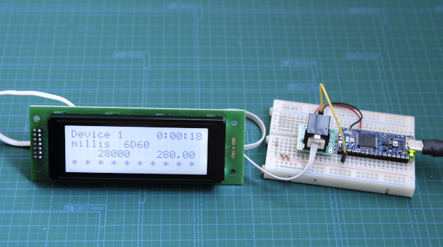
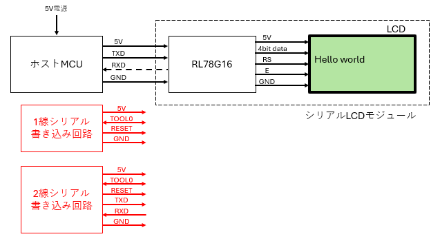
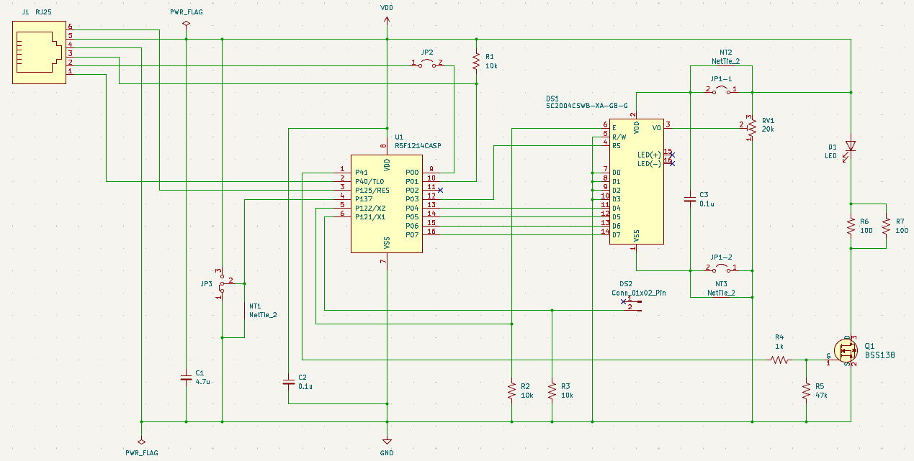
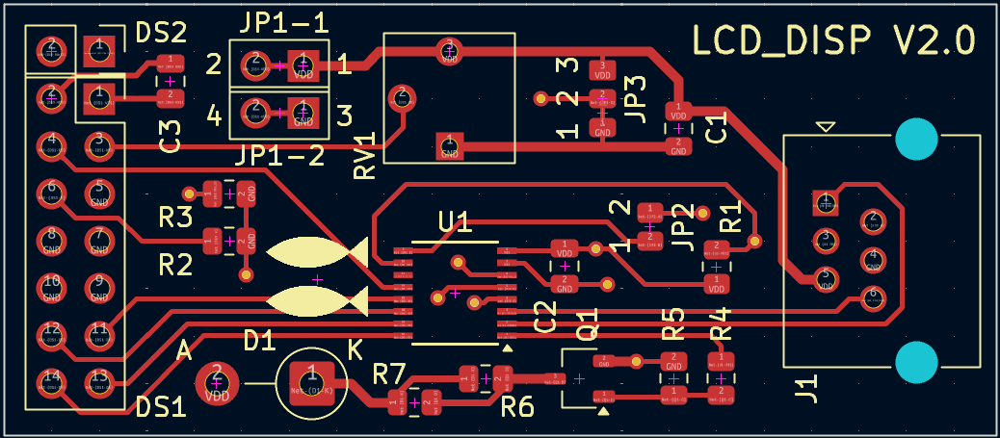
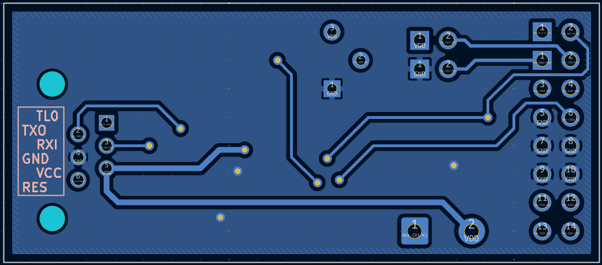
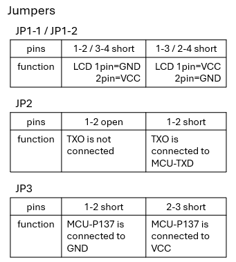
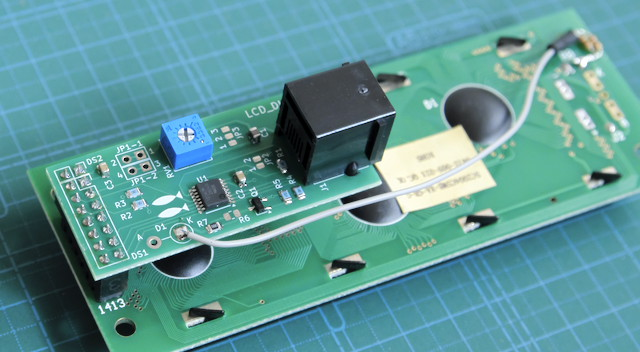
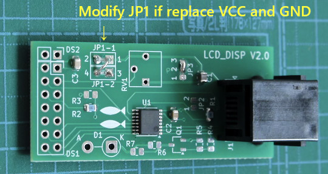

# lcd_disp_2

## 内容 / Contents
- `lcd_disp_2/` :  
UART入力のキャラクタLCDモジュール / Character LCD module with UART input  
使用したMCU：RL78/G16 16ピン / Applied MCU: RL78/G16 16pin  
ホスト側デバイス：Arduino NANO R4 / Host device: Arduino NANO R4  
Blog:  https://inte-gonext.hatenablog.com/entry/2026/07/24/102003  
  
 

---

## 参考 / references

接続図 / Connection diagram  
  
 

回路図、パターン図 / schematic and PCB layout  
  
  
  
  
 
基板の写真 / PCB photos  
  
  
 

---

## License
Copyright (c) 2026 inteGN - MIT License  
The schematic and PCB layout included in this sub-repository are provided under the MIT License, equivalent to the terms applied to the software.  

