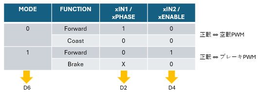
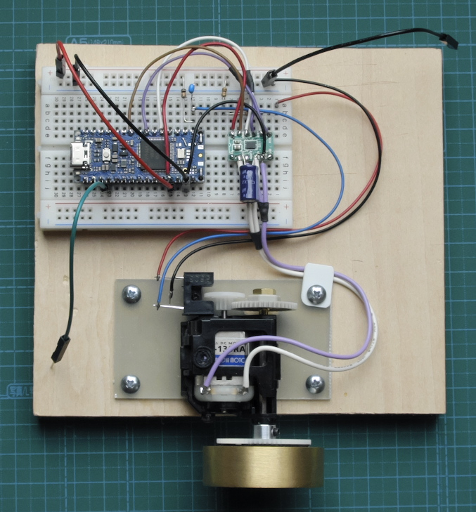
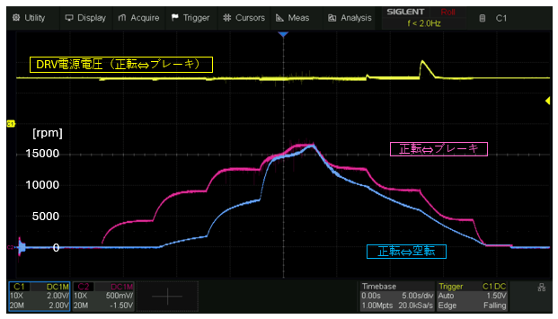

# motor_pwm_and_measurementt

## 内容 / Contents
- `motor_speed_measurement/` :  
アナログ出力付きのモータ回転数測定 / Motor speed measurement with analog output  
DRV8835に対してステップ状のデューティ比でパルスを出力 / output pulses to DRV8835 with step sweep duty ratio  
使用したボード：Arduino NANO R4 / Applied board: Arduino NANO R4  
Blog:  https://inte-gonext.hatenablog.com/entry/2026/04/--/--/  

---

## 参考 / references

ピン接続 / Pin assignment  
  
 

接続図 / Connection photo  
  
 

モータ回転数の変化 / motor speed transition  
  
 

---

## License
Copyright (c) 2026 inteGN - MIT License  

