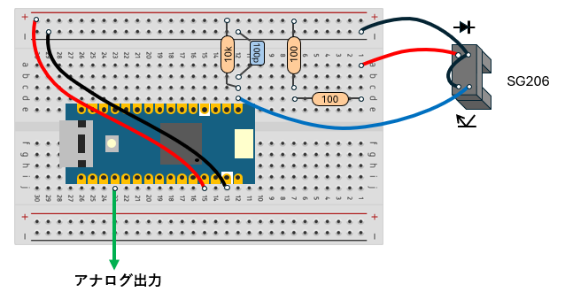

# motor_speed_measurement

## 内容 / Contents
- `motor_speed_measurement/` :  
アナログ出力付きのモータ回転数測定 / Motor speed measurement with analog output  
使用したボード：Arduino NANO R4 / Applied board: Arduino NANO R4
Blog:  https://inte-gonext.hatenablog.com/entry/2026/----

---

## 参考 / references

接続図 / Connection diagram
  
 

モータ回転数変化の動画 / video showing the motor speed  
  
 

動画中で取得したデータ / Acquired data in video  
[CSVデータ / CSV data file](docs/bench_test.csv)  
 

---

## License
Copyright (c) 2026 inteGN - MIT License  

